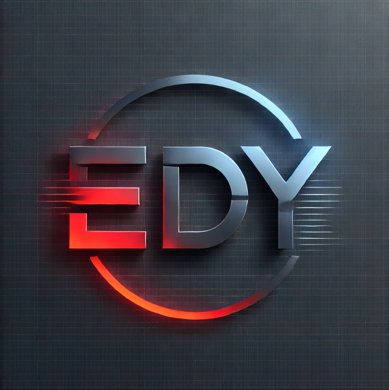

# EDY Netlix



Welcome to the EDY Netflix web clone project built with a React frontend, Node.js backend, External CPP server, MongoDB database and Docker.

## Table of Contents
- [Web Setup](#web-setup)
- [Screenshots](#screenshots)

## Web Setup

### Setting Up the Database
1. Download MongoDB Compass and create a local collection.

2. Import data from the **mongodb_databases** folder.

3. Click on your keyboard **Win + R** and then type **cmd**

4. Write in the terminal:
    ```bash
    ipconfig

5. Find in the "Wireless LAN adapter Wi-Fi" section your **IPv4 Address**

6. Set up your local connection in the MongoDB compass **to the IPv4 Address** that you have just found.


7. Download Docker Desktop to your PC.

### Launching the EDY Netflix Application
To launch the web application, follow these steps:

1. **Download the Project**:
   - Clone the repository to your local machine.

2. **Open Three Terminal Windows**:
   - You will need to run the following commands.

3. **In the First Terminal Window**:

- These **TWO** commands are needed to be run **ONLY** at the **first use** of the project.
   ```bash
   chmod +x ./setup.sh
   ./setup.sh

- The following command must be used at **every run** of the project.
    ```bash
   docker-compose build

* Don't worry, the docker-compose build process might take a few minutes.


* After the build process comes to a success, continue with the command:
    ```bash
   docker-compose up webserver

4. **In the Second Terminal window**:
* After completing the tasks on the first terminal window, do the following:
    ```bash
    docker-compose frontend

5. **In the Third Terminal window**:
* After completing the task on the second terminal window, do the following:
    ```bash
    docker compose run --name server server

6. **Open Your Browser:**:
    - Navigate to http://localhost:8000/

    ```bash
    Written By:
    Yehonatan Tchebiner (322711037)
    Efrat Babchik (212582423)
    Dvir Weinman (206397226) 

## Explore Our Wiki

Looking for more information or documentation? Check out our [Wiki](./wiki) for detailed insights and guides.

---

## Thank You for Checking Out Our Project!

We sincerely appreciate you taking the time to explore our work. This project represents countless hours of dedication, collaboration, and passion for creating something meaningful.

If you have any feedback, questions, or suggestions, we’d love to hear from you! Feel free to reach out or contribute to make this project even better.

**Star this repository** if you found it interesting, and share it with others who might benefit. Together, we can build amazing things.
