# EDY Netflix - Web App Demonstration
### **The images below may appear large, affecting their layout. For the best experience, simply click on any image to view it in full size. This will open the image in its actual resolution and provide a clearer view of the content.**

### **Home Page**
The Home Page offers a variety of useful features, including:

* A video list displaying all available videos on the platform divided into categories.
* A search bar to filter videos by title, or search for a category and find the videos that are included in it.
* User icon that when it's being clicked it opens a pull out menu that offers the user to log out or change the theme of the home page. 
* Movies page button which navigates to the movies page.
* A random movie is being previewed when the website is being set.

# Home Page Views
| 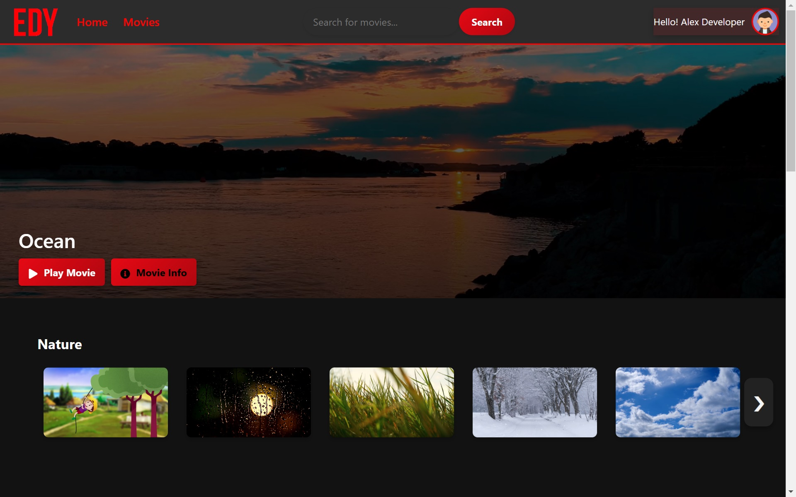 | 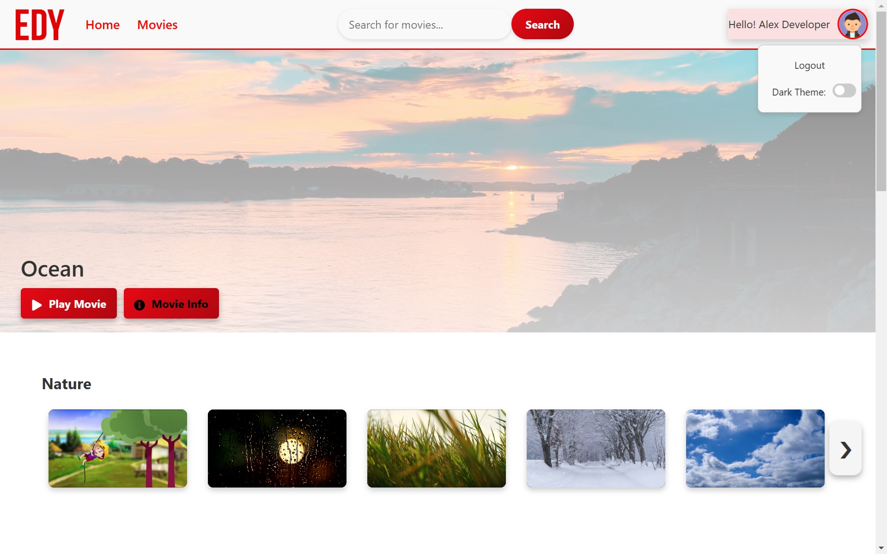| 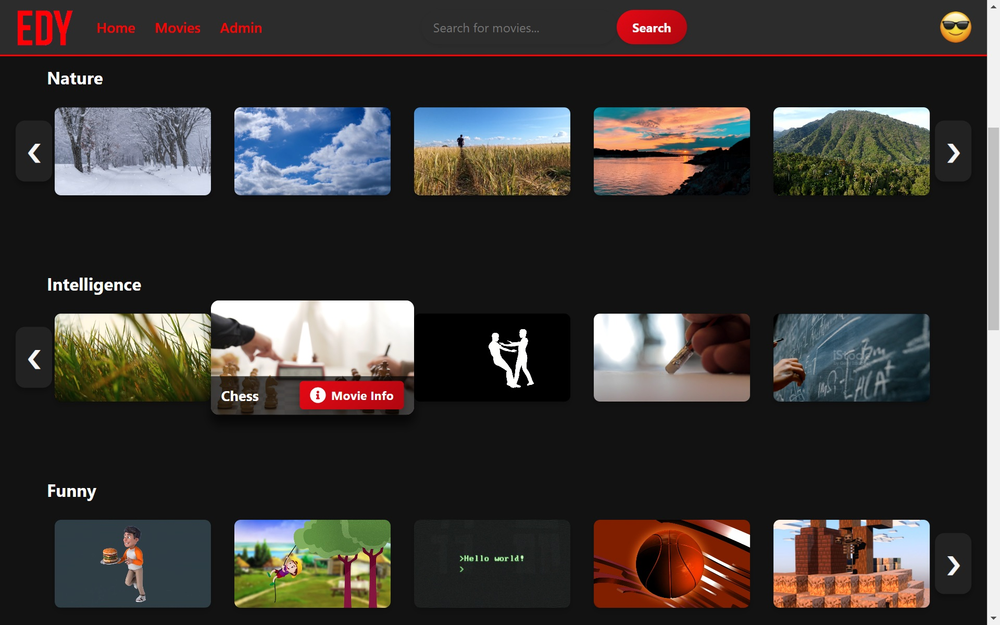 |
|:------------------------------------------------------------:|:------------------------------------------------------------:|:------------------------------------------------------------:|
| Home page standard - Dark mode | Light mode | Categories at Home Page |

### **Search Page**
* The search page allows users to quickly and efficiently find their desired content by searching
  for movies or categories. It provides relevant results from the existing database, enabling a seamless user experience.

# Search Page Views 
| 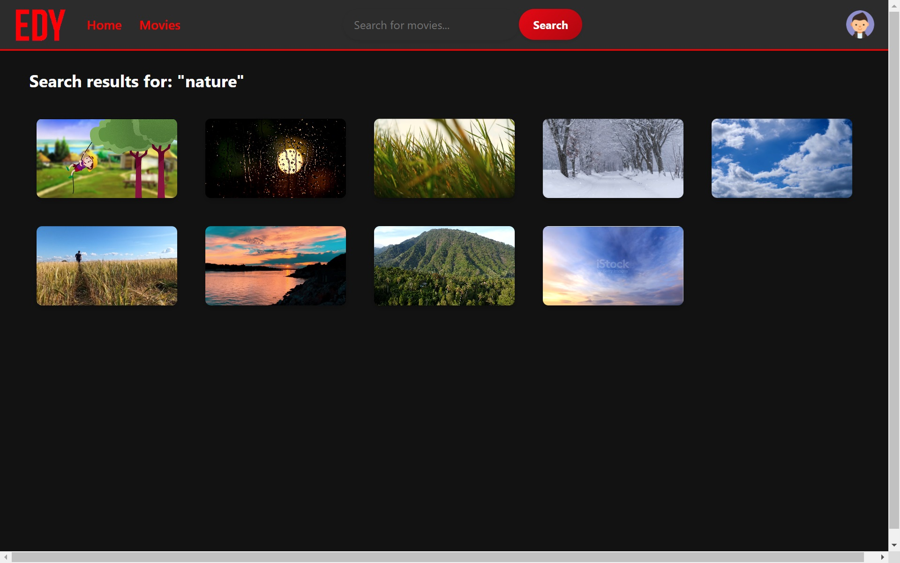 |
|:------------------------------------------------------------:|
| Search |

### **Movies Page**
* The Movies are being presented by categories and are being abled to be filtered by categories
  according to the desire of the user.

# Movies Page Views
| 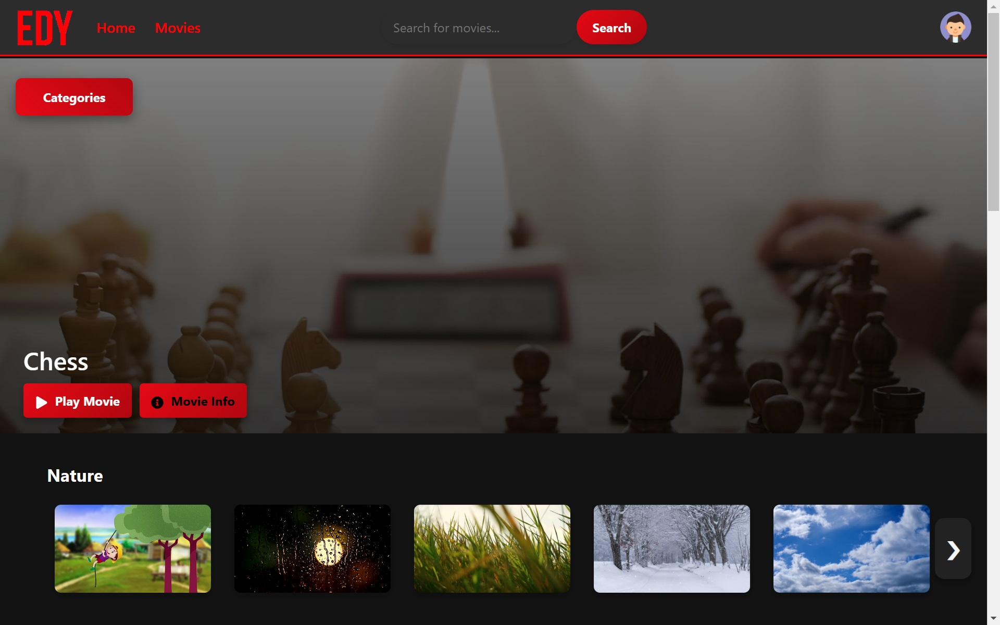 |
|:------------------------------------------------------------:|
| Movies Page |

### **Movie Information Page**
* The information about the movie will be presented in this page, including the name of the movie,
  it's categories, and the recommended movies (based on the recommendations algorithm from the CPP server in a previous part of the project) at the bottom.

# Movie Information Page
| 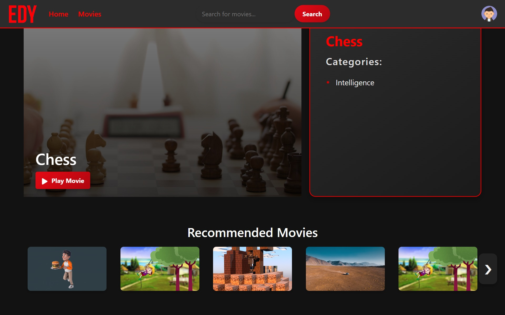 |
|:------------------------------------------------------------:|
| Movies Information Page |

### **Watch Movie Page**
* The Watch Movie Page provides users with a seamless video-watching experience. It offers a clean and minimalistic design that focuses entirely on the movie.
* Key features include:
  * The ability to watch videos in full screen or within the provided frame.
  * Intuitive playback controls such as pause, skip forward, rewind, and volume adjustment.
  * A "Back" button in the top-right corner to quickly navigate back to the previous page without interrupting the experience.

# Watch Movie Page Views
| 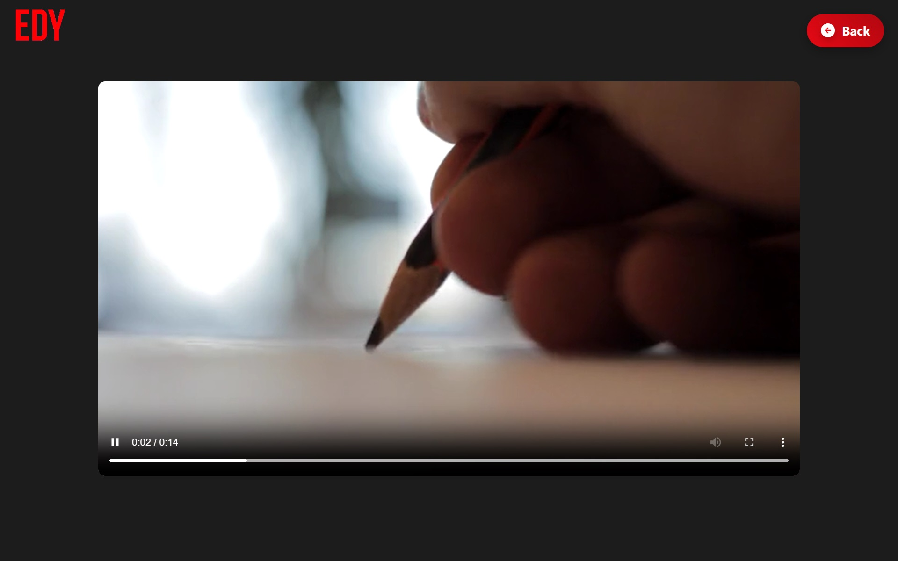 |
|:------------------------------------------------------------:|
| Watch Movie Page |

### **Home Page for Administrator Users**
The Home Page offers a variety of useful features, including:

* A video list displaying all available videos on the platform divided into categories.
* A search bar to filter videos by title, or search for a category and find the videos that are included in it.
* User icon that when it's being clicked it opens a pull out menu that offers the user to log out or change the theme of the home page. 
* Movies page button which navigates to the movies page.
* A random movie is being previewed when the website is being set.
* An additional Admin button at the navigation bar which leads to the Administrator Page.
* The rest of the pages are activated in the same way the regular user's pages are being activated
  besides that the "Admin" button at the navigation bar is only available for administrator users.

# Home Page for Administrator Users Views
| 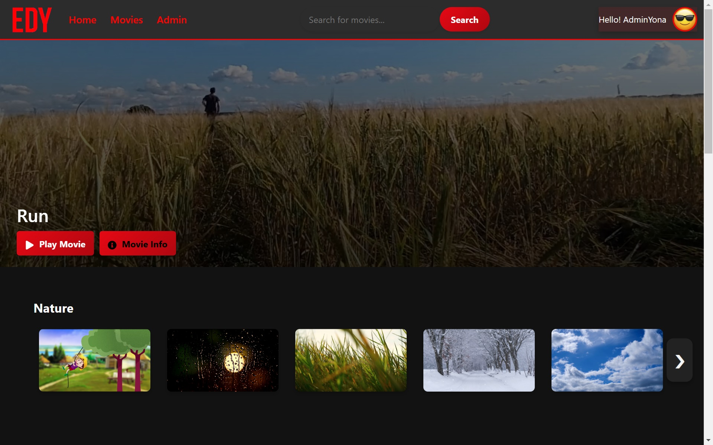 | 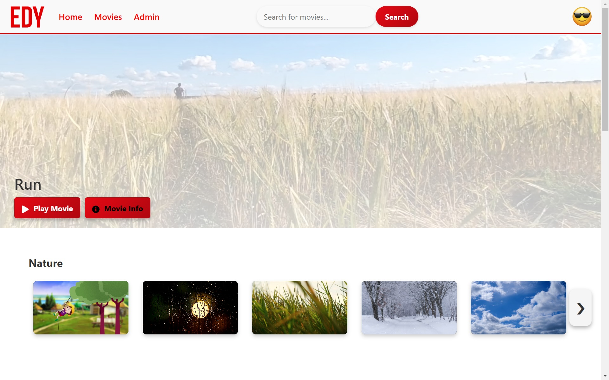|
|:------------------------------------------------------------:|:------------------------------------------------------------:|
| Home page standard - Dark mode | Light mode |

### **Home Page for Non-logged Users**
The Home Page for non-logged users allows you to choose wether to sign in to an existing user or sign up as a new user.

# Home Page for Non-logged Users Views
| 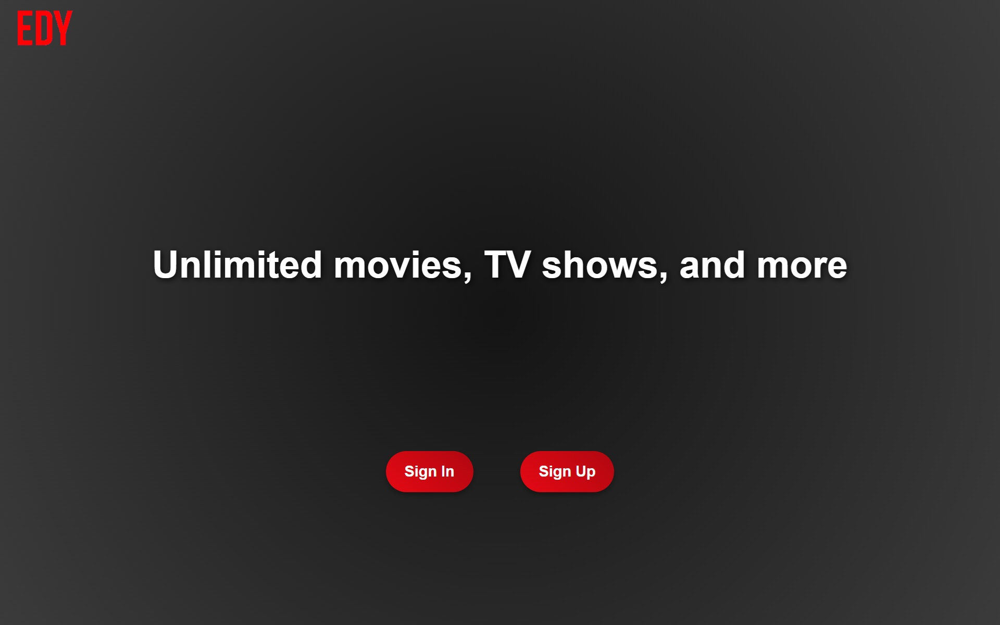 |
|:------------------------------------------------------------:|
| Home page - Non logged users |

### **Sign In Page**
The Sign Page allows you to log in to an existing one with the following validations:

* If the username is incorrect or does not exist, an alert will notify you that the user was not found.
* If the password is incorrect, an alert will notify you to check your password and try again.
* These validations ensure that account creation and login processes are secure and user-friendly.

# Sign In Views
| 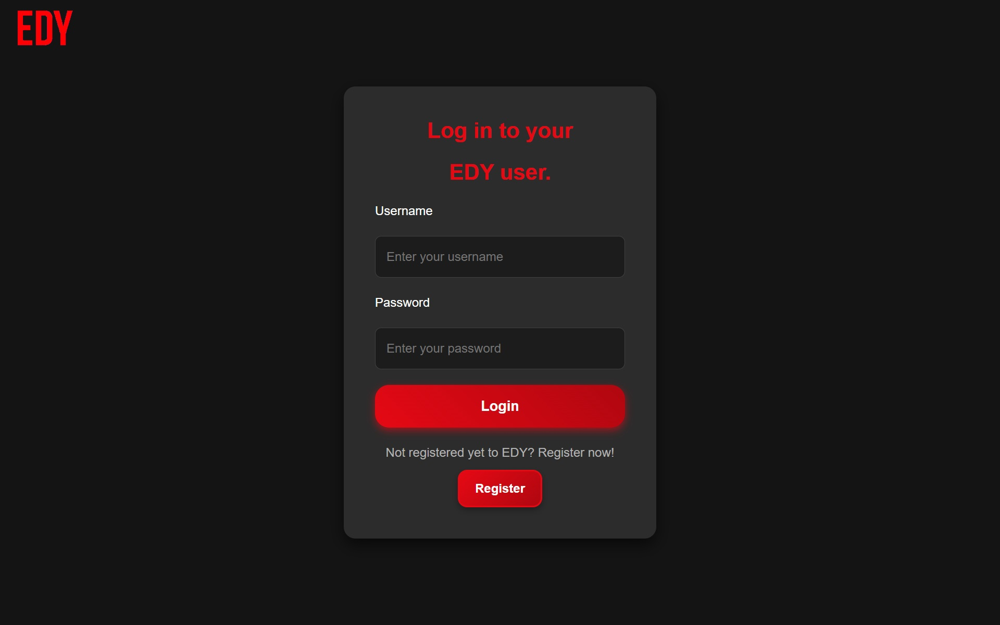 |
|:------------------------------------------------------------:|
| Sign in page |

### **Sign Up Page**
The Sign Up Page allows users to create a new account with the following features:

* Username Availability: If the username is already taken, an alert will notify the user to choose a different name.
* Password Strength: If the password is too weak, an alert will suggest creating a stronger password (e.g., using a mix of letters, numbers, and special characters).
* Password Confirmation: If the password does not match the confirmation field, an alert will notify the user to re-enter the passwords.
* User-Friendly Design: The interface is intuitive, making the sign-up process smooth and efficient, with clear guidance at each step.
* User Photo: Users can upload a profile picture during sign-up, making the experience more personalized.

# Sign Up Views
| 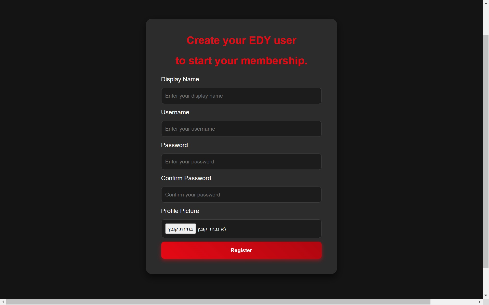 |
|:------------------------------------------------------------:|
| Sign up page |

---

### **Admin Panel Overview**
The **Admin Panel** acts as the central hub for managing movies and categories on the platform. With options to add, edit, and delete movies or categories, administrators have complete control over the platform’s content. The intuitive interface ensures that all actions are performed efficiently, with confirmation steps in place to prevent accidental changes. This centralized control panel enhances the administrator's ability to maintain a well-structured and user-friendly platform.

| 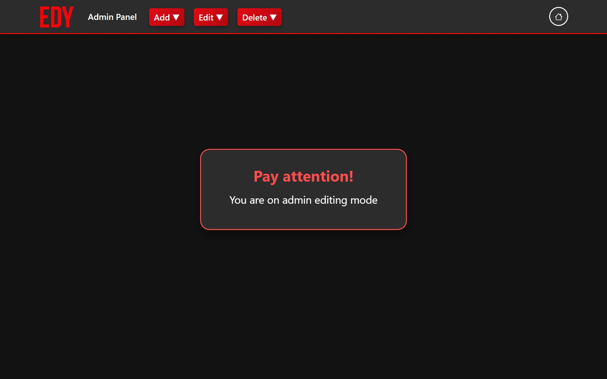 |
|:------------------------------------------------------------:|
| Admin Panel Home |

---
### **Add Movie**
The **Add Movie** feature allows administrators to add new movies to the platform seamlessly. Administrators can input the movie name, search and select relevant categories, and upload both the movie file and its thumbnail. The search functionality ensures that categories can be easily located and selected. Once all inputs are validated, administrators can confirm the addition of the movie, making it available to users in the appropriate categories.

# Add Movie Views
| 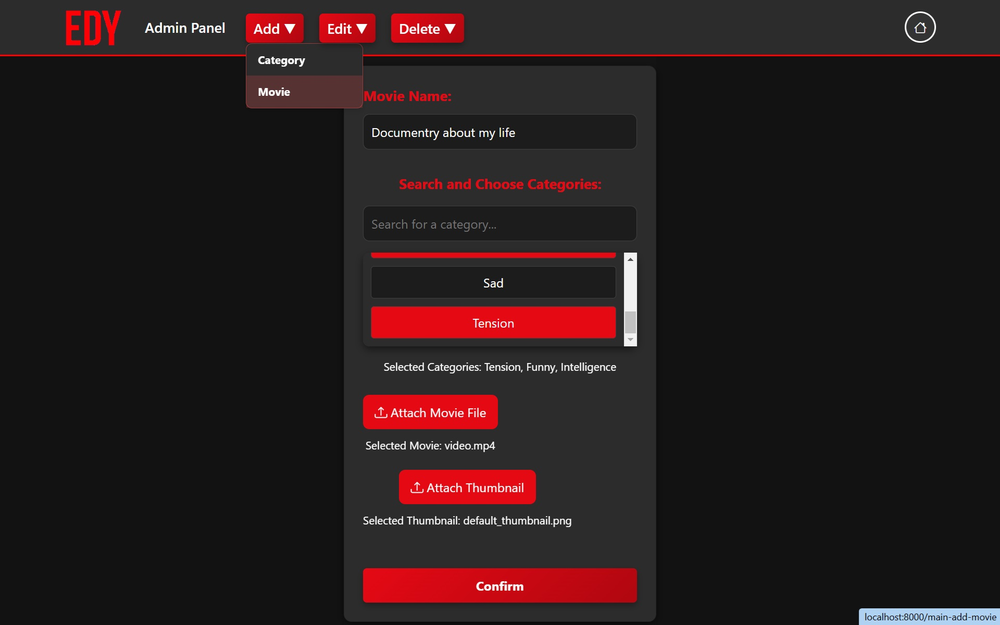 |
|:------------------------------------------------------------:|
| Add Movie Page |
---

### **Edit Movie**
The **Edit Movie** action is designed to update existing movie details effortlessly. Administrators can change the movie name, update its associated categories, or replace outdated movie files and thumbnails. The interface displays the current categories and file paths, providing a clear overview before changes are applied. This ensures that updates are accurate and the platform remains up-to-date with the latest movie information.

# Edit Movie Views
| 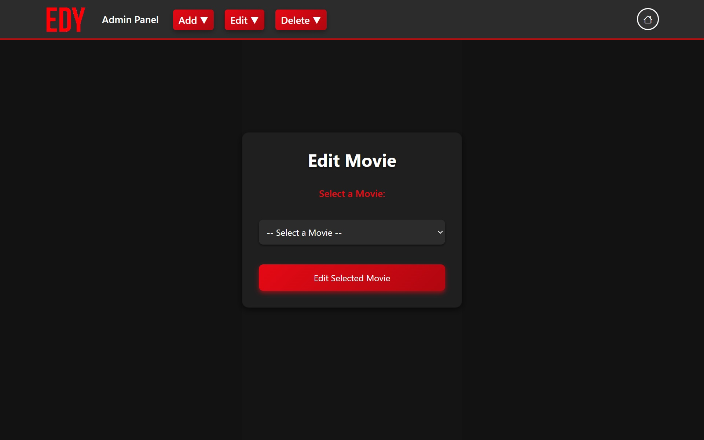 | 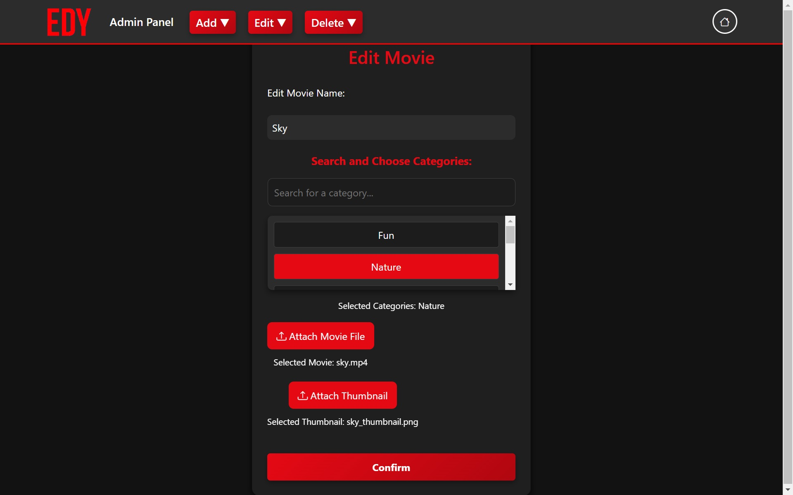 |
|:------------------------------------------------------------:|:------------------------------------------------------------:|
| Edit Movie Page - Select a Movie | Edit Movie Page |

---

### **Delete Movie**
The **Delete Movie** feature provides a straightforward way to remove movies from the platform. Administrators can search for movies by title, select one or multiple movies, and confirm the deletion. This action ensures that unwanted or outdated content is efficiently removed, keeping the platform’s content relevant and organized.

# Delete Movie Views
| 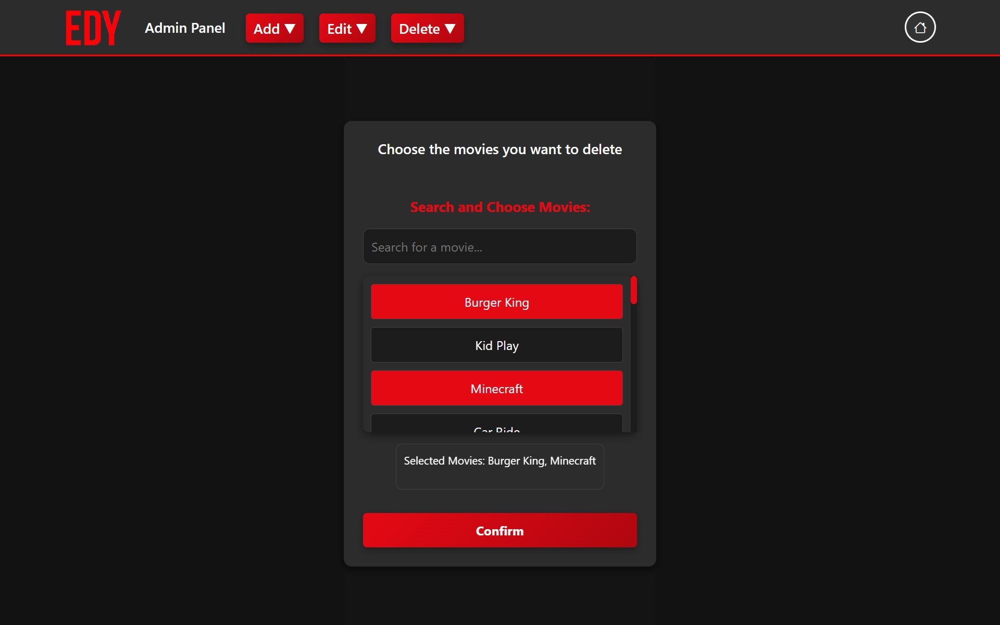 |
|:------------------------------------------------------------:|
| Delete Movie Page |
---

### **Add Category**
The **Add Category** action enables administrators to organize movies into new categories. Administrators can define a category name, choose movies to include, and specify whether the category should be promoted on the platform. This feature helps in structuring the movie library and enhancing discoverability for users by creating meaningful groupings.

# Add Category Views
| 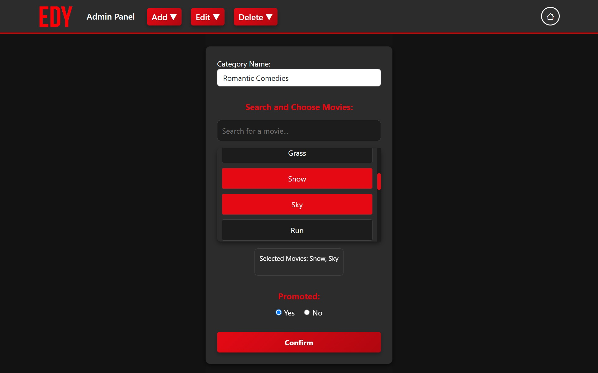 |
|:------------------------------------------------------------:|
| Add Category Page |
---

### **Edit Category**
The **Edit Category** function allows administrators to update category details. They can rename the category, add or remove movies, and adjust its promotion status. This ensures that categories remain relevant and accurately reflect the platform’s content. Administrators can fine-tune categories to better align with user preferences and trends.

# Edit Category Views
| 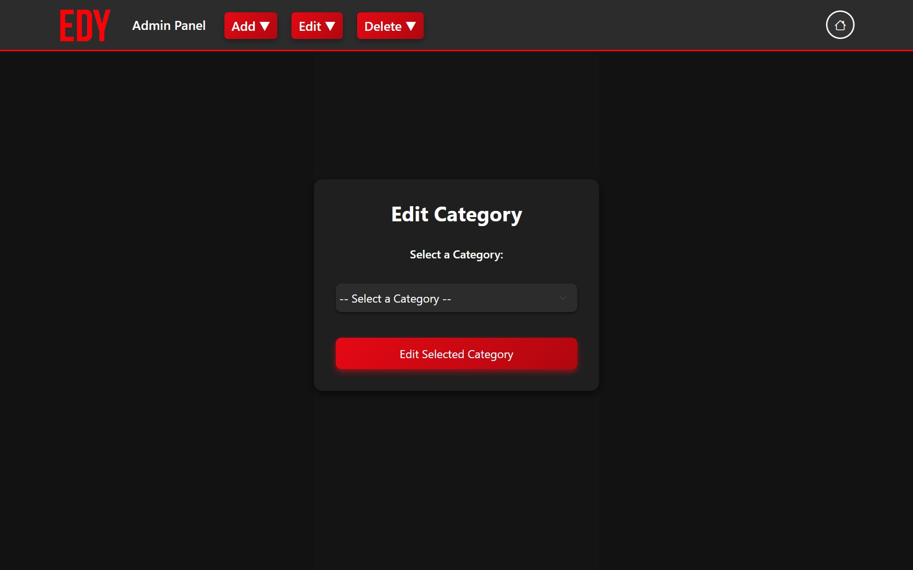 | 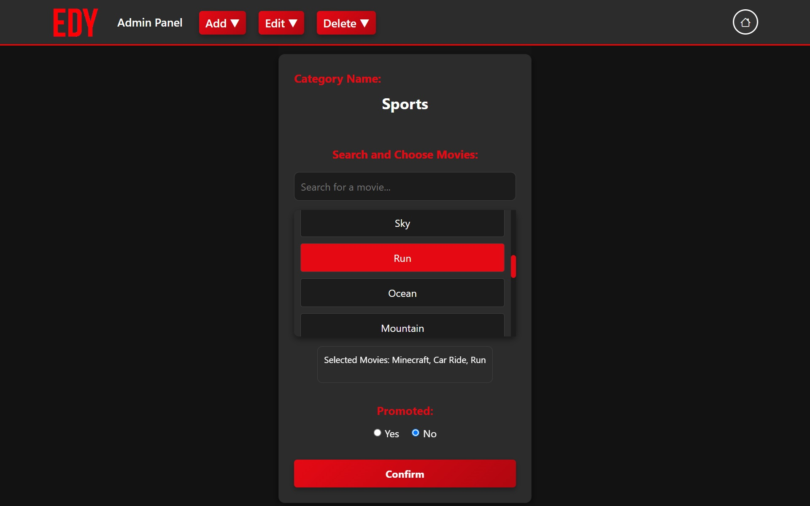 |
|:-----------------------------------------------------------------:|:-----------------------------------------------------------------:|
| Edit Category Page - Select a Category | Edit Category Page |
---

### **Delete Category**
The **Delete Category** feature simplifies the process of removing categories that are no longer needed. Administrators can search for a category, select it, and confirm its deletion. This action helps maintain a clean and organized category structure by eliminating unused or redundant groupings.

# Delete Category Views
| 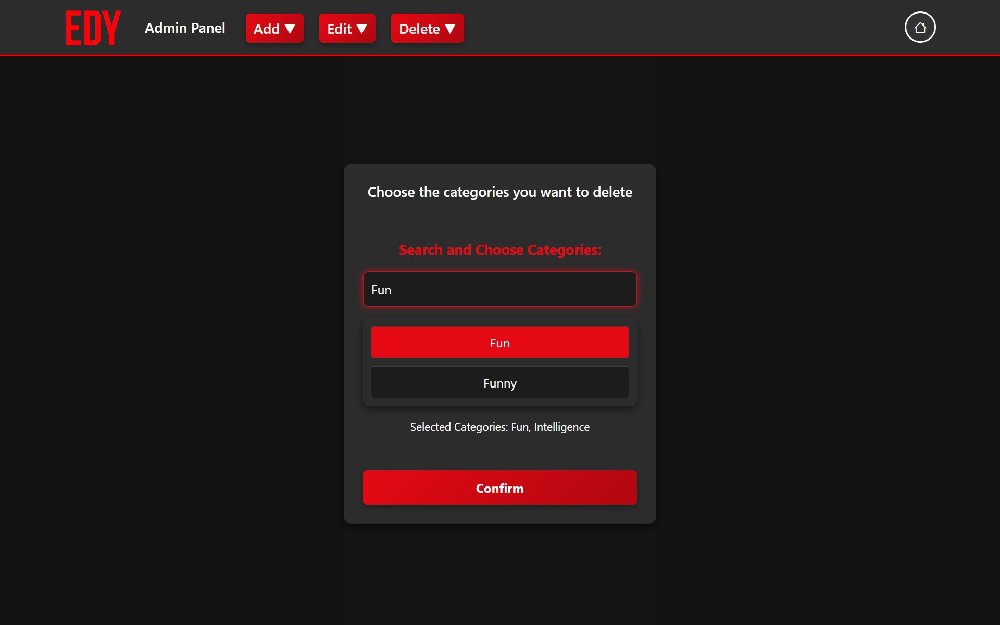 |
|:------------------------------------------------------------:|
| Delete Category Page |
---
### Conclusion
The web application provides a seamless experience for users to browse, watch, and manage movies while offering robust administrative tools to keep the platform organized and up-to-date. With intuitive designs, user-friendly navigation, and comprehensive functionality, the platform ensures an engaging experience for all.